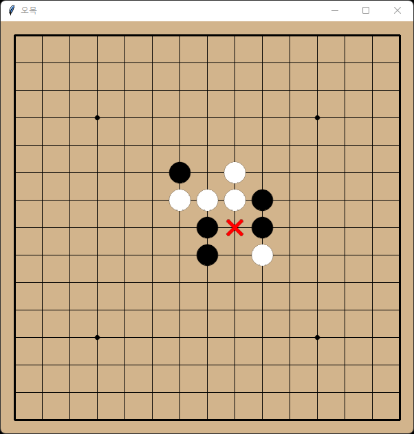

# Omok

Omok(Gomoku) game using AlphaGo and AlphaZero.  
This game is based on renju rules.

## createPNG.ipynb

'createPNG.ipynb' is the Jupyter Notebook source code that creates the required image in the GUI.

- board.png
- black.png
- white.png
- forbidden.png

## Train

Run 'train_cycle.py'.  
'data' and 'model' folders are created.  
For each game, data that two models play against each other is stored in the 'data' folder.  
The learned model file is stored in the 'model' folder.  
*(This takes a lot of time.)*

## Play

First, you have to train.  
And you can enjoy this game by running 'human_play.py'.  
*(Repeat 'train_cycle.py' if you want to improve performance.)*
